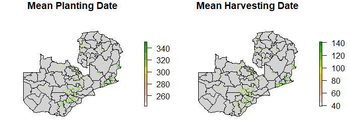
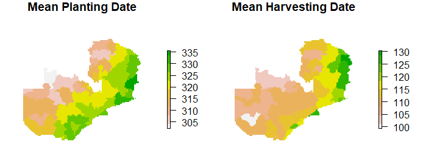
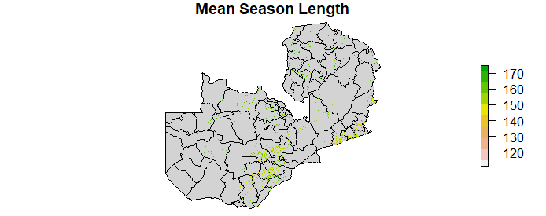
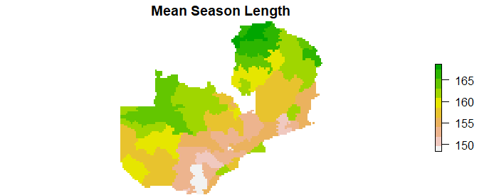

# Introduction


---

# Data Sources

- Import data
 - Zambia districts vector shapefile
 - Phenology TIFF files
 - Cropland mask TIFF file

```{r, eval=FALSE}
districts <- system.file("extdata/districts.shp", package = "geospaar")%>%
  st_read

plant <- dir("external/data/phenology/season_planting_date_30perc/",
             full.names = TRUE)
harv <- dir("external/data/phenology/season_end_30perc/", full.names = TRUE)

maskr <- dir("external/data/cropland/", pattern = ".tif", full.names = TRUE)
```
---

# Methods

- Data pre-processing
 - Reproject cropland mask file to phenology files
 - Rasterize, remove 0 values, & mask phenology files
```{r, eval=FALSE}
plant1_ras <- raster(plant[[1]])

mask_proj <- projectRaster(from = maskr, to = plant1_ras)
crop_mask <- reclassify(mask_proj, c(.75, 1, 1, -1, .7499, NA))

crop_mask[crop_mask == 0] <- NA

plant_ras <- lapply(plant, function(x) {  # x <- 1
  r <- raster(x)
  r[r < 0] <- NA
  r <- mask(x = r, mask = crop_mask)
  # plot(r)
  return(r)
})
plant_ras <- stack(plant_ras)
#save stack output as brick on disk
if(!canProcessInMemory(plant_ras)) {
  plantbrick <- brick(x = plant_ras, filename = "external/data/plantbrick.tif")
} else {
  plantbrick <- brick(plant_ras)
  save(plantbrick, file = "data/plantbrick.rda")
}
```
---

## Mean Date Analysis

- Planting/harvesting dates
 - Calculate mean planting/harvesting dates across all seasons
 - Aggregate results by mean date within districts
```{r, eval = FALSE}
#mean planting date across seasons
plantbrick <- brick("external/data/plantbrick.tif")
plant_mean <- plantbrick %>% calc(., mean)

plant_rasnegative <- (plant_mean > 365) * -365
plant_mean_corrected <- plant_mean + plant_rasnegative

#aggregate across districts
plant_zonemu <- zonal(x = plant_mean_corrected, z = distsr_rs, fun = "mean")

distr_plmu <- plant_zonemu %>% data.frame %>% select(1:2) %>%
  subs(x = distsr_rs, y = ., by = "zone")
```
---

## Mean Length Analysis

- Season length
 - Calculate mean season length between planting and harvesting dates
 - Aggregate results by mean length within districts
 
```{r, eval = FALSE}
#mean season length
slength <- overlay((365 + harvbrick), plantbrick,
                   fun = function(b1, b2){return(b1 - b2)})
```

---

# Results

---

## Planting and Harvesting Mean


```{r, eval = FALSE}
par(mfrow = c(1, 2), mar = c(0, 2, 1, 5))
plot(st_geometry(districts), col = "lightgrey", reset = FALSE,
     main = "Mean Planting Date")
plot(plant_mean_corrected, axes = FALSE, box = FALSE,
     add = TRUE, col = rev(terrain.colors(10)))
plot(st_geometry(districts), col = "lightgrey", reset = FALSE,
     main = "Mean Harvesting Date")
plot(harv_mean_corrected, axes = FALSE, box = FALSE,
     add = TRUE, col = rev(terrain.colors(10)))
```

---

## Planting and Harvesting Mean by District


```{r, eval = FALSE}
par(mfrow = c(1, 2), mar = c(0, 2, 1, 6))
plot(distr_plmu, main = "Mean Planting Date",
     axes = FALSE, box = FALSE, col = rev(terrain.colors(10)))
plot(distr_hamu, main = "Mean Harvesting Date",
     axes = FALSE, box = FALSE, col = rev(terrain.colors(10)))
```
---

## Season Length


```{r, eval = FALSE}
par(mfrow = c(1, 1), mar = c(0, 2, 1, 2))
plot(st_geometry(districts), col = "lightgrey", reset = FALSE,
     main = "Mean Season Length")
plot(slength_mean, axes = FALSE, box = FALSE, 
     add = TRUE, col = rev(terrain.colors(10)))
```
---

## Season Length by District



```{r, eval = FALSE}
par(mfrow = c(1, 1), mar = c(0, 2, 1.5, 2))
plot(distr_slmu, main = "Mean Season Length",
     axes = FALSE, box = FALSE, col = rev(terrain.colors(10)))
```


---

# Discussion

- 

---

# Thank you
## Have a nice summer

