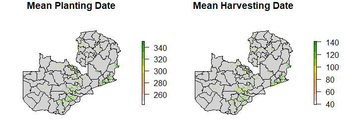
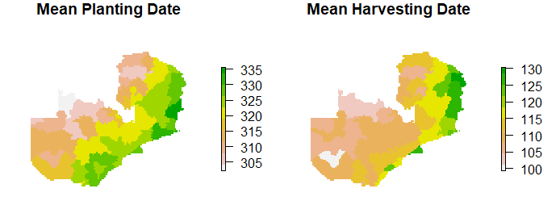
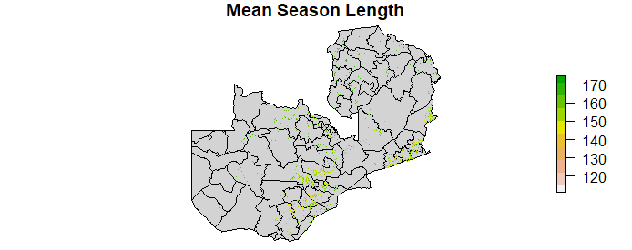
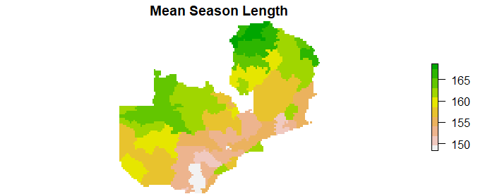

```{r setup, include=FALSE}
knitr::opts_chunk$set(echo = TRUE)
```

# Introduction (200-400 words)
The agricultural industry is essential to the culture and economy of many countries, making it important to understand the inner workings and trends of the industry. In Zambia, we are looking at the planting and harvesting dates for cropland area in order across the past two decades to determine any spatial variation that can be seen regarding planting dates, harvesting dates, and overall season length. This project is designed to gain a better understanding of the agricultural trends in Zambia on multiple scales. Through the analysis of eighteen seasons we calculate the mean harvesting and planting dates as well as the mean season length, averaging the eighteen seasons by pixel and aggregating them by Zambia's districts.

# Methods (~250 words)
### Import Data
Our data was acquired from three different sources. Our districts data came from our professor, Lyndon Estes, via the Geospaar package. Our crop_mask data came from the plantingdatecv repository in the previous year's agroimpacts group. Our phenology data for Zambia came from Sitian Xiong,contaniing 18 seasons of data from the years of 2000 to 2018.  The planting dates were calculated when the NDVI curve reached 30% of the maximum NDVI for the season, and harvesting dates when the NDVI curve decreased 70% from the maximum NDVI for the season.

```{r, eval=FALSE}
districts <- system.file("extdata/districts.shp", package = "geospaar")%>%
  st_read

plant <- dir("external/data/phenology/season_planting_date_30perc/",
             pattern = "season", full.names = TRUE)

harv <- dir("external/data/phenology/season_end_30perc/",
            pattern = "season", full.names = TRUE)

maskr <- dir("external/data/cropland/", pattern = ".tif", full.names = TRUE)
```

### Pre-processing
The districts data did not need much pre-processing, as it was already in a good format and was only used for a background for displaying the other data. We did later rasterize the districts data in order to aggregate cell-level data up to district level for ease of interpretation.

The mask data required a bit of preprocessing. First, the original TIFF data file was uploaded into the R environment, rasterized, and projected to the extent and resolution of the planting and harvesting data. After this, the values of 0 within the crop_mask file were converted to NA values, finishing its preprocessing and readying it for use in analysis.
```{r, eval=FALSE}
plant1_ras <- raster(plant[[1]])
maskr <- raster("external/data/cropland/CropZmb1V1_2015_16_fullagree.tif")

mask_proj <- projectRaster(from = maskr, to = plant1_ras)
crop_mask <- reclassify(mask_proj, c(.75, 1, 1, -1, .7499, NA))

crop_mask[crop_mask == 0] <- NA
```

The planting and harvesting data did require a fair amount of pre-processing, especially given the size of the files. We took in the files as a list of file paths and then ran them through an `lapply` statement which rasterized each file, turned the 0 values into NA values, masked the data to the cropland areas, and then put each file into a stack. These stacks were then saved as TIFF and RDA files for easy access during the analysis.
```{r, eval=FALSE}
#plant_ras <- lapply(plant, raster)
plant_ras <- lapply(plant, function(x) {  # x <- 1
  r <- raster(x)
  r[r < 0] <- NA
  r <- mask(x = r, mask = crop_mask)
  # plot(r)
  return(r)
})
plant_ras <- stack(plant_ras)

if(!canProcessInMemory(plant_ras)) {
  plantbrick <- brick(x = plant_ras, filename = "external/data/plantbrick.tif")
} else {
  plantbrick <- brick(plant_ras)
  save(plantbrick, file = "data/plantbrick.rda")
}


#harv_ras <- lapply(harv, raster)
harv_ras <- lapply(harv, function(x) {
  r <- raster(x)
  r[r < 0] <- NA
  r <- mask(x = r, mask = crop_mask)
  return(r)
})
harv_ras <- stack(harv_ras)

if(!canProcessInMemory(harv_ras)) {
  harvestbrick <- brick(harv_ras, filename = "external/data/harvestbrick.tif")
} else {
  harvestbrick <- brick(harv_ras)
  save(harvestbrick, file = "data/harvestbrick.rda")
}
```

### Planting and Harvesting Mean Analysis
The RasterBrick files of the seasons' planting and harvesting dates were respectively run through a mean calculation, resulting in a single output raster containing the mean planting and harvesting dates across all eighteen seasons. Following this calculation, the date values within each output raster were converted to Julian date values via a two-step mask for values greater than 365.  
```{r, eval = FALSE}
plantbrick <- brick("external/data/plantbrick.tif")
plant_mean <- plantbrick %>% calc(., mean)

harvbrick <- brick("external/data/harvestbrick.tif")
harv_mean <-  harvbrick %>% calc(., mean)

plant_rasnegative <- (plant_mean > 365) * -365
plant_mean_corrected <- plant_mean + plant_rasnegative

harv_rasnegative <- (harv_mean > 365) * -365
harv_mean_corrected <- harv_mean + harv_rasnegative
```

To aggregate the mean planting and harvesting dates across districts, we rasterized and projected the Zambia district data from the Geospaar package. The mean planting and harvesting dates within each district were then calculated using the `zonal` statistical function. The tabular outputs of each mean operation were then respectively converted to data frames and converted back to spatial data through the subs function using the raster districts as the target layer.
```{r, eval = FALSE}
zamr <- raster(x = extent(districts), crs = crs(districts), res = 0.1)
values(zamr) <- 1:ncell(zamr)
districts <- districts %>% mutate(ID = 1:nrow(.))
distsr <- districts %>% rasterize(x = ., y = zamr, field = "ID")
distsr_rs <- resample(x = distsr, y = plant_mean_corrected, method = "ngb")

plant_zonemu <- zonal(x = plant_mean_corrected, z = distsr_rs, fun = "mean")
harv_zonemu <- zonal(x = harv_mean_corrected, z = distsr_rs, fun = "mean")

distr_plmu <- plant_zonemu %>% data.frame %>% select(1:2) %>%
  subs(x = distsr_rs, y = ., by = "zone")
distr_hamu <- harv_zonemu %>% data.frame %>% select(1:2) %>%
  subs(x = distsr_rs, y = ., by = "zone")
```

### Season Length Mean Analysis
The mean length of each season was calculated by adding 365 to all harvest dates and subtracting them from all planting dates within an `overlay` function.  This output was then aggregated using the same methods as the mean district planting and harvesting dates.
```{r, eval = FALSE}
slength <- overlay((365 + harvbrick), plantbrick,
                   fun = function(b1, b2){return(b1 - b2)})
slength_mean <- slength %>% calc(., mean)

slength_zonemu <- zonal(x = slength_mean, z = distsr_rs, fun = "mean")

distr_slmu <- slength_zonemu %>% data.frame %>% select(1:2) %>%
  subs(x = distsr_rs, y = ., by = "zone")
```

# Results (200-400 words)
### Planting and Harvesting Mean
The output of calculating the mean planting and harvesting dates between 2000 and 2018 for cropland in Zambia is shown below (see Fig. 1). Most of the cropland area is concentrated along the southeastern portion of the Zambia, with scattered areas spread out across the rest of the country. The range of mean planting dates is between approximately 1 and 363 in Julian dates.  The range of mean harvesting dates is between approximately 26 and 161 in Julian dates.
```{r, eval = FALSE}
par(mfrow = c(1, 2), mar = c(0, 2, 1, 5))
plot(st_geometry(districts), col = "lightgrey", reset = FALSE,
     main = "Mean Planting Date")
plot(plant_mean_corrected, axes = FALSE, box = FALSE,
     add = TRUE, col = rev(terrain.colors(10)))
plot(st_geometry(districts), col = "lightgrey", reset = FALSE,
     main = "Mean Harvesting Date")
plot(harv_mean_corrected, axes = FALSE, box = FALSE,
     add = TRUE, col = rev(terrain.colors(10)))
```


The output aggregation by mean within the districts of Zambia is shown below (see Fig. 2). The minimum and maximum district mean planting dates are approximately 302 and 336 in Julian dates, respectively. The minimum and maximum district mean harvesting dates are approximately 99 and 130 in Julian dates, respectively. The highest values for mean planting date fall within the districts along Zambia's southeastern border. The districts with the highest values for mean harvesting date fall along Zambia's eastern border.
```{r, eval = FALSE}
par(mfrow = c(1, 2), mar = c(0, 2, 1, 6))
plot(distr_plmu, main = "Mean Planting Date",
     axes = FALSE, box = FALSE, col = rev(terrain.colors(10)))
plot(distr_hamu, main = "Mean Harvesting Date",
     axes = FALSE, box = FALSE, col = rev(terrain.colors(10)))
```


### Season Length Mean
The output of calculating the mean season length between 2000 and 2018 for cropland across Zambia is shown below (see Fig. 3). The range of mean season lengths is between approximately 109 and 184 days.
```{r, eval = FALSE}
par(mfrow = c(1, 1), mar = c(0, 2, 1, 2))
plot(st_geometry(districts), col = "lightgrey", reset = FALSE,
     main = "Mean Season Length")
plot(slength_mean, axes = FALSE, box = FALSE, 
     add = TRUE, col = rev(terrain.colors(10)))
```


The output of calculating the mean season length within the districts of Zambia is shown below (see Fig. 4). The range of mean district season lengths is between approximately 148 and 169 days. The longest season lengths occur in districts in the northern region of Zambia.
```{r, eval = FALSE}
par(mfrow = c(1, 1), mar = c(0, 2, 1.5, 2))
plot(distr_slmu, main = "Mean Season Length",
     axes = FALSE, box = FALSE, col = rev(terrain.colors(10)))
```


# Discussion (200-400 words)
The results of our analysis clearly show spatial dependence of planting season length and latitudinal placement across Zambia.  

